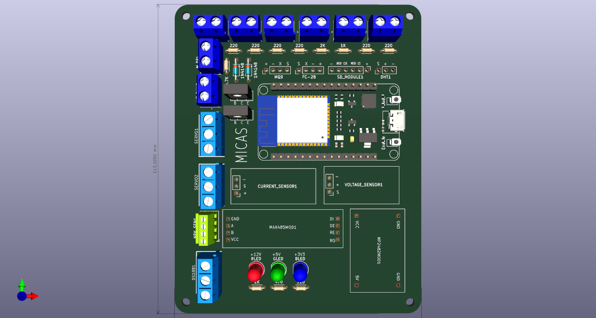

# Measurement, Instrumentation, Control, and Automatization System for Plant's Health

## Description
MICAS is an IoT-based system for monitoring and automating irrigation and fertilization in agricultural or garden environments. It uses an ESP32 microcontroller to read multiple sensors (soil moisture, temperature, NPK nutrients, ambient light, humidity, temperature, water level) and control actuators (water pump, electrovalve). Data is published via MQTT to a Node-RED dashboard for visualization and alerts. The system is containerized using Docker for easy deployment of the MQTT broker and Node-RED.

## Features
- Real time monitoring of soil moisture, temperature, NPK nutrients, ambient light, ambient temperature, ambient humidity, and water tank level.
- Automatic irrigatio based on soil moisture tresholds.
- Automatic fertilization triggered when NPK levels fall below configurable tresholds.
- Environmental alerts for abnormal temperature, humidity, light, or low water level.
- Data loggign to an SD card in CSV format.
- MQTT integration for remote monitoring and control.
- Node-RED dashboard with live gauges, charts, and status LEDs.
- Dockerized infrastructure (Mosquitto + Node-RED) for easy setup.

## Hardware Components
1. ESP32 Dev Board
2. Soil Moisture Sensor (FC-28)
3. Soil Temperature Sensor (Thermistor)
4. NPK Sensor (RS485)
5. LDR (Light Sensor)
6. Water Level Sensor (Two wires)
7. DHT11 (Ambient Temp/Hum)
8. Water Pump Relay
9. Electrovalve Relay
10. SD Card Module (SPI)
11. MAX485 (RS485 to TTL)

## Schematic Diagrams
- [MICAS_SCH.pdf](Docs/MICAS_SCH.pdf)
- [Docs/MICAS_SCHEM](Docs/MICAS_SCHEM.pdf)
- [MICAS_PCB](Docs/MICAS_PCB.pdf)

## Software Components
* Arduino Code: Runs on ESP32, reads sensors, controls actuators, logs data to SD card, and publishes to MQTT.
* Mosquitto MQTT Borker: Handles message passing between ESPE32 and Node-RED
* Node-RED: Provides a visual dashboard and flow-based logic for data visualization and alerts.
* Docker Compose: Mosquitto and Node-RED containers

## MQTT Topics
The ESP32 publishes sensor readings and actuator states to the following topics (default):

* `esp32/SOILHUM` – Soil humidity (%)
* `esp32/SOILTEMP` – Soil temperature (°C)
* `esp32/SOILNUTN` – Nitrogen (mg/kg)
* `esp32/SOILNUTP` – Phosphorus (mg/kg)
* `esp32/SOILNUTK` – Potassium (mg/kg)
* `esp32/AMBHUM` – Ambient humidity (%)
* `esp32/AMBTEMP` – Ambient temperature (°C)
* `esp32/LDRVAL` – Light intensity (raw)
* `esp32/LVLVAL` – Water level (raw) – also used for low-water alert
* `esp32/WP1S` – Water pump 1 status (0/1)
* `esp32/WP2S` – Water pump 2 status (0/1)
* `esp32/EVS` – Electrovalve status (0/1)
* `esp32/Nutrientstatus` – Nutrient low alert (0/1)

## Other Information
- Authors & Contact: juandospinor@gmail.com